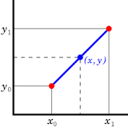
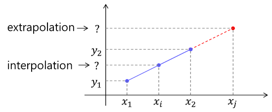

보간법 polation

보간법 :  알려진 데이터 지점의 고립점 내에서 새로운 데이터 지점을 구성하는 방식

openCV 보간법 : 홀 주변 화소값들의 정보를 이용하여 비어있는 화소에 값을 넣어준다

interpolation : 알려진 지점의 값 사이(중간)에 위치한 값을 알려진 값으로부터 추정

ex) 20살일때의 키 , 40살 일때의 키를 보고 30살에서의 키를 추정

extrapolation : 알려진 값들 사이의 값이 아닌 범위를 벗어난 외부의 위치에서의 값을 추정

ex) 20살일때의 키 , 40살 일때의 키를 보고 10년후의 키를 예측하여 추정

